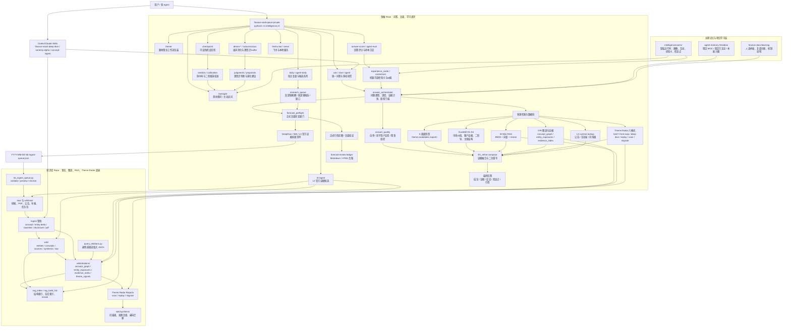
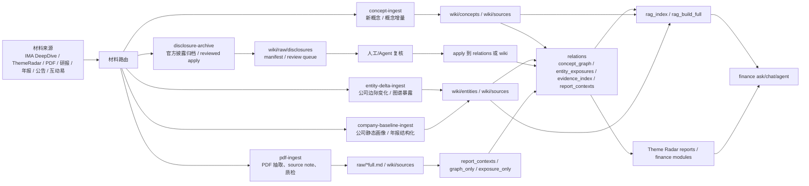

# 金融 Agent 能力图谱

这张图用于回答一个问题：**我的金融 Agent 现在有哪些节点、路径和回路？**

维护口径：
- 新增入口命令、服务模块、知识库 ingest 管线、运行时证据源、学习闭环或后台自动化时，都要回到本页追加节点。
- 单次问答纠偏不进本页；只有稳定能力、稳定流程或跨 repo 边界变化才更新。
- 主图只画“人能记住的能力节点”，细碎脚本放到节点清单或项目 MOC，避免图变成源码依赖图。

## 总览图

## 复盘前瞻闭环

```mermaid
flowchart TD
  Start["收盘后数据落库<br/>DuckDB / exports / daily review artifacts"] --> DailyAgent["agent-daily<br/>生成候选、研究动作、kb ingest queue"]
  DailyAgent --> RQ["research_queue"]
  RQ --> Gate["forecast_preflight"]
  Gate -->|ready| Forecast["正式次日行情前瞻"]
  Gate -->|missing_daily_agent| Missing["先生成或同步 daily-agent"]
  Gate -->|needs_deepdive| Need["先补 DeepDive / IMA / 官方证据"]
  Need --> Human["用户补 deepdive 或确认研究缺口"]
  Human --> Ingest["知识库 ingest<br/>concept/entity/disclosure/baseline"]
  Ingest --> ReDaily["重跑 agent-daily / 更新 research_queue"]
  ReDaily --> Gate
  Forecast --> Ledger["forecast-review-ledger<br/>原文、假设、验证字段、人类指正"]
  Ledger --> Verify["T+1 / 多日验证<br/>不以单个股涨跌反推推翻"]
  Verify --> Cards["经验卡 / corrections / checkpoint"]
  Cards --> Forecast
```

## 知识库 ingest 与 RAG 闭环

## 节点清单

| 节点 | 所在仓库 | 主要路径 | 作用 |
|---|---|---|---|
| CLI 总入口 | finance | `intelligence/cli.py` | 聚合 ask、daily、theme、l3、foresight、checkpoint、dream 等命令 |
| 问答入口 | finance | `intelligence/services/ask.py` | 多源检索、模块 fan-out、compose 入口 |
| 多轮对话 | finance | `intelligence/services/ask_chat.py` | 首轮检索后复用证据做追问 |
| 自主工具 Agent | finance | `intelligence/services/agent.py` | LLM 自主决定调用只读检索工具 |
| 问答编排器 | finance | `intelligence/services/answer_orchestrator.py` | 问题类型、深度、视角、证据计划、质检门槛 |
| 正式复盘查漏门 | finance | `intelligence/services/forecast_preflight.py` | daily-agent 缺口未补齐时暂停正式复盘 |
| 回答质量层 | finance | `intelligence/services/answer_quality.py` | 输出前自审、叙事组织、影子用户反驳 |
| LLM 融合层 | finance | `intelligence/services/llm_refine.py` | compose、二次反驳/重写、provider 兼容 |
| L3 运行时证据 | finance | `intelligence/services/l3_evidence.py` | 公告、互动易、问询函运行时补查 |
| L3 入库候选 | finance | `intelligence/services/l3_ingest.py` | 把官方证据解析成候选 payload 或 source note |
| daily-agent | finance | `intelligence/workflows/daily_agent.py` | 生成每日候选、research_queue、kb-ingest-queue |
| 复盘台账 | finance | `docs/learning/forecast-review-ledger/` | 保存假设原文、验证、人类指正 |
| 经验卡 | finance | `intelligence/services/experience_cards.py` | 低分回答/纠偏压缩成下次提示规则 |
| 可证伪点 | finance | `intelligence/services/checkpoints.py` | 登记、回检、校准历史判断 |
| 潜意识模式 | finance | `intelligence/services/subconscious.py` | 深挖纪要 buffer、判断提案、commit |
| 夜间演化 | finance | `intelligence/dream/` | digest、evolve suggest、kb candidates |
| 知识库接收任务包 | knowledge | `scripts/kb_ingest_queue.py` | 接收金融 repo 的跨仓 JSON 队列 |
| 关系查询 | knowledge | `scripts/query_relations.py` | 安全查询 relations 大 JSON |
| RAG 检索 | knowledge | `scripts/rag_index.py`、`scripts/rag_build_full.py` | 结构索引、全文索引、BM25/向量/rerank |
| Theme Radar 报告 | knowledge | `skills/theme-radar-reports/` | scan、replay、migrate 三类报告 |
| 概念入库 | knowledge | `skills/concept-ingest/` | 新概念与概念增量 |
| 公司边际变化 | knowledge | `skills/entity-delta-ingest/` | 公司 delta、graph_only、exposure_only |
| 公司 baseline | knowledge | `skills/company-baseline-ingest/` | iFinD/年报等 L2 静态底座 |
| 官方披露归档 | knowledge | `skills/disclosure-archive/` | archive-only 到 reviewed apply |
| PDF 入库 | knowledge | `skills/pdf-ingest/` | PDF/OCR/raw/source note/质检 |
| 长期记忆 | agent-memory | `20_projects/`、`10_knowledge/` | 项目级交接与稳定方法论 |

## 更新规则

新增能力时按以下顺序补：

1. **先定位层级**：入口命令、服务模块、工作流、知识库 skill、数据源、学习闭环、后台自动化、长期记忆。
2. **主图只加稳定节点**：如果只是临时脚本，不进总览；如果会被 CLI、workflow、skill 或 daily-agent 长期调用，进图。
3. **同时补节点清单**：写清仓库、路径、作用。
4. **跨仓边界必须画边**：例如 finance 生成队列、knowledge 接收；finance 调 RAG、knowledge 提供索引。
5. **避免事实污染**：项目经验、问答打分和用户纠偏写项目学习层；公司/题材事实写知识库；项目级流程变化写 agent-memory。

## 变更记录

- 2026-07-02 · codex · 首版：基于 `finance-workspace-private` 与 `knowledge-base-private` 的 CLI、README、skills、docs 和近期 agent-memory 交接记录生成。
