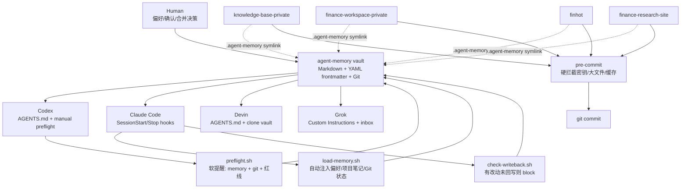
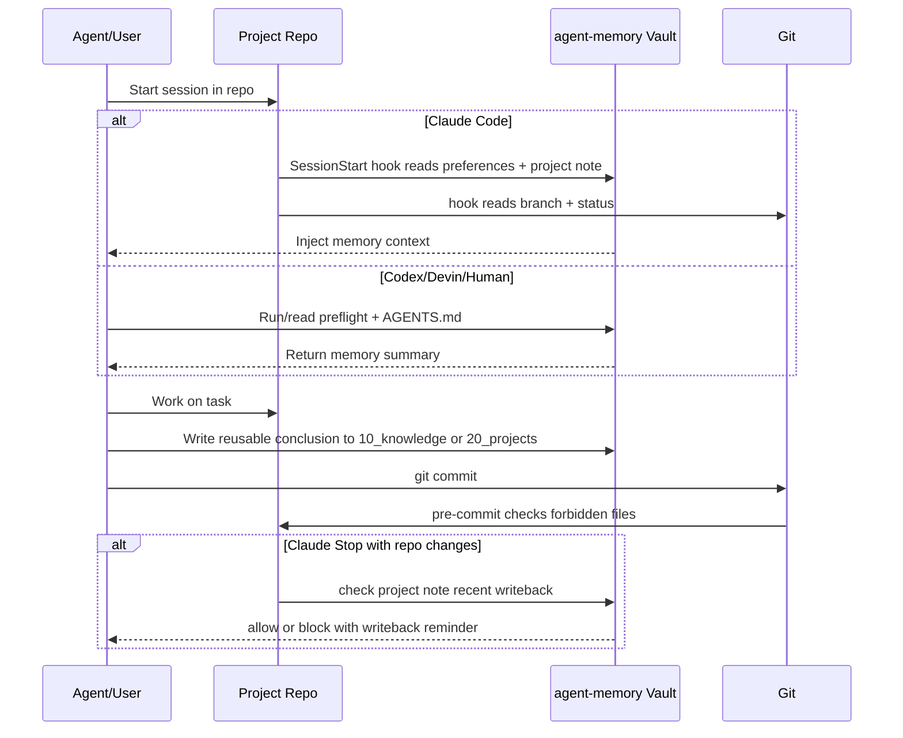

# 多 Agent 共享记忆底座系统设计

## 一句话结论

这套系统把 `/Users/a77/agent-memory` 设计成一个**跨 Agent 共享的 Markdown/Obsidian 记忆层**：各项目仓通过 `.agent-memory` 软链、`AGENTS.md`、Claude SessionStart/Stop hook、`preflight.sh` 和 `pre-commit` 共同接入。它不是重型数据库，也不是中心调度器，而是一个“人类可读、Git 可追踪、Agent 可消费”的轻量知识基础设施。

面试可以这样概括：这是一个面向多智能体协作的 lightweight memory platform，核心目标是在不绑定单一工具的前提下，解决上下文加载、任务交接、知识沉淀和安全提交四个问题。

## 背景与目标

当前有多个 Agent/工具参与同一组金融项目：

- Codex：系统性规划、审阅、沉淀设计。
- Claude Code：本机代码执行，适合通过 hook 自动注入上下文。
- Devin：云端开发执行，需要通过仓库规则和 PAT/clone 接入记忆。
- Grok：搜索和外部信息补充。
- 人类：最终裁决、维护偏好、确认合并。

系统目标：

- **自动读**：Agent 开工时拿到用户偏好、项目背景、Git 现状。
- **准自动回写**：有实质改动时，结束前提醒或拦截，要求沉淀结论。
- **红线硬拦截**：禁止提交密钥、大文件、缓存、虚拟环境等危险文件。
- **可迁移**：不依赖某一个 Agent 的私有记忆格式，换工具不丢上下文。
- **可教学/可面试**：沉淀成系统设计材料，能解释架构权衡。

## 术语表

这篇文档里会用到一些工程缩写。先把它们翻译成人话：

| 术语 | 释义 |
|---|---|
| Agent | 能执行任务的 AI 工具或智能体，比如 Codex、Claude Code、Devin、Grok。 |
| MOC | Map of Content，内容地图。可以理解成一个项目的目录页/总览页，记录项目背景、看板、交接记录和相关链接。 |
| frontmatter | Markdown 文件开头的 YAML 元数据块，通常夹在两行 `---` 之间，用来写标题、类型、日期、标签等机器可读信息。 |
| wikilink / 双链 | Obsidian 里的 `[[笔记名]]` 链接，能把两篇笔记关联起来。 |
| hook | 钩子脚本。某个事件发生时自动执行的脚本，比如 Claude 开窗时自动读记忆、Git 提交前自动检查。 |
| SessionStart hook | Claude Code 会话开始时触发的 hook，用来自动注入偏好、项目笔记和 Git 状态。 |
| Stop hook | Claude Code 准备结束回复时触发的 hook，用来检查是否需要回写记忆。 |
| preflight | 开工前检查。这里指 `preflight.sh`，一次性展示记忆、Git 状态和红线提醒。 |
| pre-commit | Git 提交前执行的检查机制。这里用它拦截密钥、大文件、缓存等不该提交的内容。 |
| CI | Continuous Integration，持续集成。通常指 GitHub Actions 这类远端自动检查/测试流程。 |
| RAG | Retrieval-Augmented Generation，检索增强生成。先从知识库检索相关资料，再让模型基于资料回答。 |
| BM25 | 一种关键词检索/排序算法，适合精确匹配文件名、术语、股票名、代码等。 |
| rerank | 重排序。先粗召回一批候选资料，再用更强模型重新排序，把最相关的放前面。 |
| FTS | Full-Text Search，全文检索。SQLite FTS5 就是本地数据库里的全文搜索能力。 |
| PAT | Personal Access Token，个人访问令牌。用于让工具访问 GitHub 等服务，不能明文写入仓库。 |

## 架构图



## 核心组件

### 1. 记忆底座：Markdown + Obsidian + Git

目录分层：

- `10_knowledge/`：长期可复用知识，如本系统设计。
- `20_projects/`：每个项目的 MOC、任务看板、交接记录。
- `30_conventions/`：跨 Agent 规则、偏好、frontmatter 规范。
- `40_playbooks/`：可复用流程，如 preflight、回写。
- `50_agents/`：不同 Agent 的接入说明。

为什么用 Markdown/Obsidian：

- 人类可读，非程序员也能直接维护。
- Git diff 清晰，适合审查和回滚。
- Agent 可以用普通文件 API 读取，不依赖私有 SDK。
- Obsidian 双链让知识之间形成轻量图谱。

替代方案：

| 方案 | 优点 | 缺点 | 当前取舍 |
|---|---|---|---|
| Markdown/Obsidian | 简单、透明、可迁移、Git 友好 | 查询能力弱，结构约束靠规范 | 当前最佳，适合早期系统 |
| SQLite/关系库 | 查询强、可加约束 | 人类可读性差，编辑门槛高 | 后期可作为索引层 |
| 向量库/RAG | 适合大规模语义召回 | 成本更高，有召回误差 | memory 变大后再加 |
| SaaS 知识库 | 协作 UI 好 | 工具锁定，Agent 接入不稳定 | 不适合作为底层真相源 |

可复用知识点：这个模式适合任何“多工具协作 + 长期项目记忆”的场景。核心不是 Obsidian 本身，而是**用人类可读格式做 single source of truth，再让工具围绕它接线**。

### 2. 自动加载：Claude SessionStart hook

Claude Code 在四个项目仓配置了 `.claude/settings.json`，开窗、恢复、清空、压缩上下文时触发：

- 读取 `30_conventions/preferences.md`。
- 读取当前 repo 对应的 `20_projects/<repo>.md`。
- 输出当前分支和 `git status --short`。
- 提醒回写约定。

这个设计解决的问题是：模型不能只靠“记得要读文件”，而要通过 hook 把关键上下文推入会话。

权衡：

- hook 自动化程度高，但只覆盖 Claude Code。
- Codex/Devin 仍需通过 `AGENTS.md` 和 `preflight.sh` 接入。
- hook 输出会消耗上下文，因此只注入偏好和项目笔记，不注入所有历史材料。

面试讲法：这是 push-based context injection。相比让模型自己检索，它更确定；相比把所有记忆塞进系统 prompt，它更实时、可维护。

### 3. 手动 preflight：跨 Agent 软提醒

`preflight.sh` 用于 Codex、Devin、本机人类手动运行：

```sh
bash .agent-memory/preflight.sh
```

输出内容：

- 当前 repo、分支、工作树状态。
- 红线提醒。
- 项目笔记摘要。
- 完工回写提醒。

定位：它不是强制门禁，而是降低漏读记忆和漏看 Git 状态的概率。

权衡：

- 优点：跨工具通用，任何 shell 都能跑。
- 缺点：依赖人或 Agent 记得运行。
- 补偿：Claude 用 SessionStart hook 自动化；提交安全交给 pre-commit 硬拦截。

### 4. Stop hook：准自动回写门禁

Claude 的 `check-writeback.sh` 在 Stop 阶段运行：

- 如果工作树干净且本地不领先上游，放行。
- 如果项目笔记最近 10 分钟被修改，视为已回写，放行。
- 否则返回 `{"decision":"block"}`，要求把关键结论写回 `20_projects/<repo>.md`。

这是“准自动”的原因：它不替 Agent 写结论，但会阻止有改动的会话悄悄结束。

权衡：

- 优点：显著降低“做完不沉淀”的概率。
- 缺点：用“最近 10 分钟修改”作为启发式判断，可能误判。
- 可优化：未来可在回写记录里写 session id / commit hash，做更精确的完成确认。

### 5. pre-commit：红线硬拦截

四个项目仓都有 `.pre-commit-config.yaml`，主要规则：

- `detect-private-key`：检测私钥。
- `check-added-large-files`：拦截超过 5MB 的新增文件。
- `check-merge-conflict`：拦截冲突标记。
- 自定义 forbidden files：拦截 `.env*`、`*.pem`、`*.key`、`*.pdf`、`*.zip`、`*.duckdb`、`*.db`、`.DS_Store`、`__pycache__/`。

权衡：

- pre-commit 是本机 hook，不随 Git clone 自动启用；新机器必须 `pre-commit install`。
- `.pre-commit-config.yaml` 随仓库走，规则可版本化。
- `--no-verify` 可以绕过，所以它是强提醒/硬拦截，不是绝对安全边界。

面试讲法：这是 shift-left safety guard，把安全检查前移到开发者提交前，而不是等 CI 或代码审查才发现。

## 数据流



## 容量估算

这是本地优先的轻量系统，容量瓶颈不在存储，而在上下文注入和人类维护。

### 当前量级假设

- 项目数：4 个主要 repo。
- Agent 数：4 类。
- 项目笔记：每 repo 1 个 MOC，约 1-5 KB。
- 偏好/规范/playbook：几十个 Markdown 文件，每个 1-10 KB。
- `10_knowledge`：假设每周沉淀 5 篇，每篇 3-8 KB。

一年规模：

- 知识卡：`5 * 52 = 260` 篇。
- Markdown 正文：按 6 KB/篇估算，约 1.6 MB。
- 加上项目笔记、规范、playbook，整体仍可能低于 20-50 MB。

### 上下文成本估算

Claude SessionStart 每次注入：

- `preferences.md`：约 1-2k tokens。
- 单个项目 MOC：约 0.5-2k tokens。
- Git status：几十到数百 tokens，脏工作树很多时可能更高。

总计通常约 2-5k tokens，可接受。真正需要控制的是不要自动注入整个 `10_knowledge/`，否则知识卡增长后会拖慢会话并挤占工作上下文。

### 性能瓶颈

| 层 | 可能瓶颈 | 当前处理 | 未来优化 |
|---|---|---|---|
| 文件读取 | Markdown 很多后人工查找慢 | 目录分层 + frontmatter | SQLite FTS / ripgrep 索引 |
| 上下文注入 | 自动注入过多导致 token 浪费 | 只注入偏好 + 项目 MOC | 按任务检索相关知识 |
| Git 状态 | 未跟踪文件过多导致噪音 | 开工显示 status | 清理/ignore 临时文件 |
| 安全提交 | hook 未安装或被绕过 | 文档 + pre-commit | CI 再跑同样规则 |

## 演进路线

### Phase 1：Markdown 单一真相源（当前）

特点：

- 规则清晰，成本低。
- 手动 preflight + Claude hook + pre-commit 已覆盖主要风险。
- 适合 4 个 repo、几十到几百篇知识卡。

### Phase 2：轻量检索索引

当 `10_knowledge/` 超过几百篇后，引入：

- `rg`/ripgrep：快速关键词检索。
- SQLite FTS5：本地全文索引。
- frontmatter 聚合脚本：按 `type/tags/status/related` 查询。

为什么不是马上上向量库：当前知识规模小，关键词和结构化 frontmatter 足够。过早上向量库会增加维护复杂度。

### Phase 3：Hybrid RAG

当问题从“找某篇笔记”变成“跨几十篇知识综合回答”时，引入：

- BM25/FTS：保证关键词精确召回。
- 向量检索：补语义相似召回。
- rerank：把召回结果重新排序，减少无关上下文。

面试常考点：Hybrid 检索比单纯向量检索更稳，因为金融、代码、文件名、专有名词高度依赖精确匹配；rerank 用来提高最终上下文质量。

## 关键权衡

### 1. 简单性 vs 自动化

当前选择：核心用 Markdown/Git，自动化只加在最痛的地方。

- 自动化过少：Agent 容易忘记读记忆、忘记回写。
- 自动化过多：系统变复杂，出问题时难排查。
- 当前折中：Claude 自动读/准自动回写，其他 Agent 保留手动 preflight。

### 2. 人类可读 vs 机器强约束

当前选择：人类可读优先，靠 frontmatter 和模板提供轻量结构。

- Markdown 方便读写，但 schema 约束弱。
- 数据库约束强，但维护门槛高。
- 当前阶段把“规范”写进 `frontmatter-spec.md`，未来可加 lint 脚本。

### 3. Hook 门禁 vs CI 门禁

当前选择：pre-commit 先挡一层，未来可在 CI 重跑。

- pre-commit 反馈快，适合本机开发。
- CI 更强制，适合防止 `--no-verify` 绕过。
- 当前风险主要在本机多 Agent 协作，pre-commit 的收益最大。

### 4. 全量注入 vs 按需检索

当前选择：只注入“偏好 + 项目 MOC + Git 状态”。

- 全量注入简单但浪费 token。
- 按需检索复杂但可扩展。
- 当前 memory 规模小，先用固定核心上下文；知识卡增长后再加检索。

## 故障模式与防护

| 故障 | 表现 | 防护 | 改进方向 |
|---|---|---|---|
| Agent 忘读记忆 | 回答风格/规则跑偏 | AGENTS.md + hook + preflight | Codex 也接入自动 preflight |
| 做完不回写 | 下个 Agent 断档 | Claude Stop hook | commit hash 级回写确认 |
| 提交敏感文件 | `.env`/密钥进仓库 | pre-commit | CI secret scan |
| 工作树噪音太多 | Git 现状不可读 | hook 显示 status | 定期清理 + .gitignore |
| 记忆过期 | Agent 引用旧决策 | status/date/source | stale_after / last_verified |
| 规则冲突 | AGENTS、memory、skill 不一致 | 优先级约定 | 写入统一 conflict policy |

## 当前已知改进点

- `preflight.sh` 中 shell 变量如果紧贴中文字符，应该统一写成 `${repo}` 形式，避免 `set -u` 下出现变量边界识别问题。
- pre-commit 自定义红线目前覆盖 `.env*`、密钥、大文件、`__pycache__` 等，但如果要严格覆盖“缓存或虚拟环境”，应补充 `.venv/`、`venv/`、`node_modules/`、`.pytest_cache/`、`.mypy_cache/`、`.ruff_cache/`、`dist/`、`build/` 等模式。
- 文档中可补充 `python3 -m pre_commit ...` 作为 `pre-commit` 命令不在 PATH 时的替代用法。

## 面试版回答框架

如果面试官问“你怎么设计多 Agent 的长期记忆系统”，可以按这个顺序讲：

1. **问题定义**：多个 Agent 参与多个 repo，最大风险是上下文丢失、偏好不一致、任务交接断裂、安全红线被漏掉。
2. **核心设计**：用 Markdown/Obsidian + Git 做共享记忆层，项目通过软链、规则文件和 hook 接入。
3. **读路径**：Claude 用 SessionStart hook 自动注入；Codex/Devin/人用 AGENTS.md 和 preflight。
4. **写路径**：任务完成后回写项目 MOC；可复用知识沉淀到 `10_knowledge`；Claude Stop hook 做门禁。
5. **安全路径**：pre-commit 拦截密钥、大文件、缓存和冲突标记。
6. **容量判断**：早期 Markdown 足够；几百篇后加 FTS；再大才上 Hybrid RAG。
7. **权衡**：人类可读优先，牺牲部分强 schema；hook 提高确定性，但保留手动路径兼容其他 Agent。

一句压缩版：

> 我把多 Agent 记忆设计成一个 Git 托管的 Markdown single source of truth，用 hook 做确定性上下文注入，用 Stop hook 和 pre-commit 做流程门禁，早期保持简单可读，规模上来后再加 FTS/Hybrid RAG 检索层。

## 参考

- [[preferences]]
- [[frontmatter-spec]]
- [[preflight]]
- [[claude-hooks]]
- [[devin-writeback]]
- [[agent-division]]
